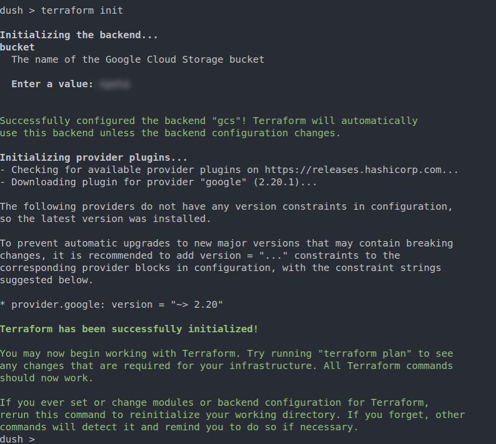
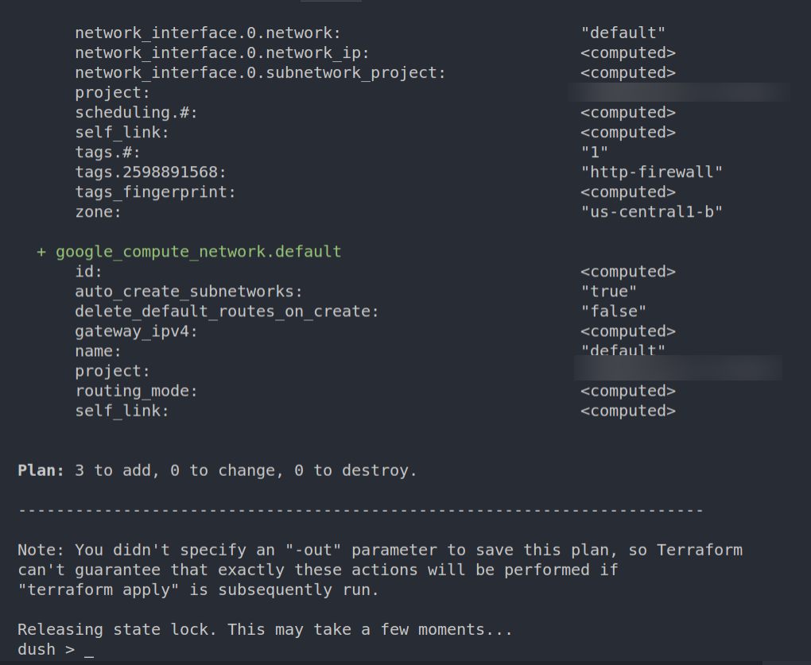
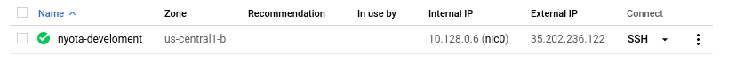

# Creating a VM instance

## Prerequistes
1. If you havent already ensure you have exported you google application credentials as follows on your terminal:
```
export GOOGLE_APPLICATION_CREDENTIALS="path-to-your credentials.json file"
```
This is the Service Account JSON key that you generate after adding roles for the service account.
2. Ensure that the account.json file (in the account folder) contains the gcp credentials added when [creating the base image](../base-image/README.md)

3. Install Terraform (ubuntu)

If you have snap installed you can simply call:

```
sudo snap install terraform
```

Else, install wget and unzip packages if they are not already installed;

to install *unzip* and *wget*

```
sudo apt-get install wget unzip
```

Download latest version of terraform (substituting the newer version number if needed; [check version here](https://www.terraform.io/downloads.html))
```
wget https://releases.hashicorp.com/terraform/0.12.7/terraform_0.12.7_linux_amd64.zip
```

Extract the downloaded file archive
```
unzip terraform_0.12.7_linux_amd64.zip
```
Move the executable into a directory searched for executables
```
sudo mv terraform /usr/local/bin/
```

check the version to confirm installation
```
terraform --version
```
You should see something similar to this
```
Terraform v0.12.7
+ provider.google v2.13.0
```
4. Clone the repository
Clone the repository as follows:
```
git clone https://github.com/pelly-realtors/pelly-realtors-website.git
```

## Set up the environment variables
Change the name of [terraform.tfvars.example](./terraform.tfvars.example) to *terraform.tfvars*. This file is going to be used by the terraform templates as a source of sensitive information that is necessary for the process to succeed. The file contains;

| **Key**           | **Value Description**|
|-------------------|----------------------|
| region            | A region is a specific geographical location where you can host your resources such as images and firewalls and contains multiple zones. You can find out more about regions and zones [here](https://cloud.google.com/compute/docs/regions-zones/)|
| zone              | Your resources such as the vm instance are located in a particular zone|
| project           | The google project id where you are hosting your application on.|
| ip-address        | If the instance needs a fixed IP address that does not change (the one assigned is temporal) yo can find the instruction on how to reserve an IP [here](https://cloud.google.com/compute/docs/ip-addresses/reserve-static-external-ip-address#reserve_new_static) or [here](https://cloud.google.com/compute/docs/ip-addresses/reserve-static-external-ip-address#promote_ephemeral_ip)|
| db-name     | This is the name of the database that contains the app's persistent data.|
| user              | This designates the role of a user who is responsible for the management of the database (creation, deletion), and who has the privileges to do so.|
| password          | Authenticates the user to use the database|
| postgres-ip       | Facilitates communication between your application requests to the database host|
| GS_BUCKET_NAME | Name of google storage bucket|
| GS_BUCKET_URL | Url for the bucket|
| github-branch | Github branch to clone |

## Initialize terraform
**NB** This step requires the name of the storage bucket you created for the app.
To initialize the app, run the following command (ensure you are in the folder that contains your template)
```
terraform init
```

You should see something similar to:



## Simulate the plan creation
This step simulates the creation of the instance without actually creating anything. Use the command below to create the plan
```
terraform plan
```
If it's successful you should get something similar to the image below:



## Create the infrastructure
If there are no errors in the step above and everything goes according to plan, its time to create the instance using the command below
```
terraform apply
```

visit the the dashboard in the vm section and something similar to the image below should appear.

